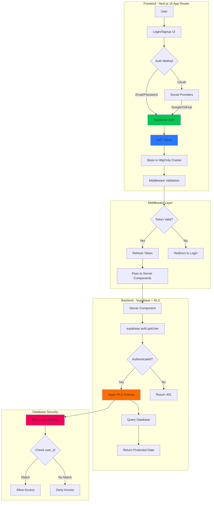
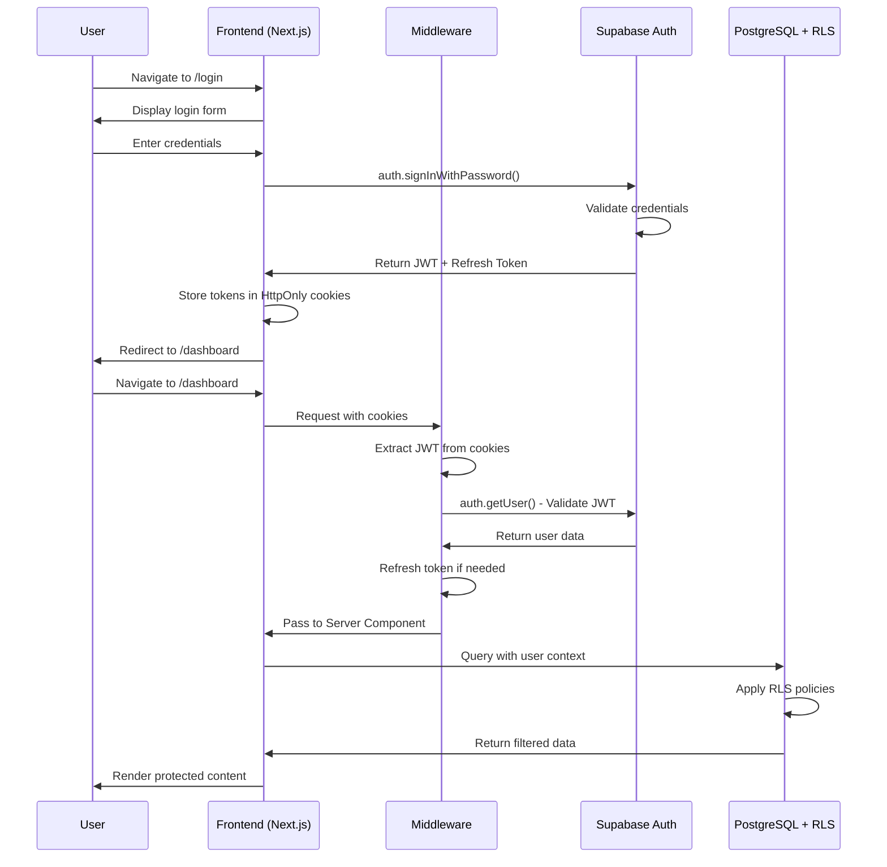

# SaaS Factory - Authentication Pipeline

## 🎯 Vision
Pipeline estandarizado para implementar autenticación robusta en **menos de 30 minutos**, optimizado para YouTube creators que necesitan lanzar SaaS MVPs rápidamente.

## 📊 Authentication Architecture Flow



## 🔥 Recommended Stack (2025)

### Option 1: Supabase Auth (RECOMMENDED for speed)
**Best for:** Developers wanting unified backend + free tier
- ✅ **Setup Time:** 15 minutes
- ✅ **Cost:** Free tier + scaling options
- ✅ **Features:** Email, OAuth, Magic Links, JWT, RLS
- ✅ **Integration:** Native Next.js support

### Option 2: Clerk
**Best for:** Pre-built UI components + zero config
- ⚡ **Setup Time:** 10 minutes
- 💰 **Cost:** Free up to 10k MAU, then paid
- ✨ **Features:** Drop-in components, SSO, User Management
- 🎨 **UI:** Beautiful pre-built components

### Option 3: NextAuth (Auth.js)
**Best for:** Full control + custom databases
- 🔧 **Setup Time:** 30 minutes
- 💵 **Cost:** Free (self-hosted)
- 🛠️ **Features:** OAuth, Email, Custom providers
- ⚙️ **Flexibility:** Maximum customization

## 🚀 Quick Start Guide - Supabase Auth

### Step 1: Installation (2 minutes)
```bash
npm install @supabase/supabase-js @supabase/ssr
```

### Step 2: Environment Variables (1 minute)
```env
NEXT_PUBLIC_SUPABASE_URL=your_supabase_url
NEXT_PUBLIC_SUPABASE_ANON_KEY=your_anon_key
```

### Step 3: Create Supabase Client (3 minutes)
```typescript
// lib/supabase/client.ts
import { createBrowserClient } from '@supabase/ssr'

export function createClient() {
  return createBrowserClient(
    process.env.NEXT_PUBLIC_SUPABASE_URL!,
    process.env.NEXT_PUBLIC_SUPABASE_ANON_KEY!
  )
}
```

### Step 4: Middleware for Token Refresh (5 minutes)
```typescript
// middleware.ts
import { createServerClient } from '@supabase/ssr'
import { NextResponse } from 'next/server'
import type { NextRequest } from 'next/server'

export async function middleware(request: NextRequest) {
  let response = NextResponse.next()

  const supabase = createServerClient(
    process.env.NEXT_PUBLIC_SUPABASE_URL!,
    process.env.NEXT_PUBLIC_SUPABASE_ANON_KEY!,
    {
      cookies: {
        get(name) { return request.cookies.get(name)?.value },
        set(name, value, options) { response.cookies.set({ name, value, ...options }) },
        remove(name, options) { response.cookies.set({ name, value: '', ...options }) }
      }
    }
  )

  // Refresh session if expired
  await supabase.auth.getUser()

  return response
}

export const config = {
  matcher: ['/dashboard/:path*', '/api/:path*']
}
```

### Step 5: Protected Route Example (5 minutes)
```typescript
// app/dashboard/page.tsx
import { redirect } from 'next/navigation'
import { createClient } from '@/lib/supabase/server'

export default async function DashboardPage() {
  const supabase = createClient()

  const { data: { user }, error } = await supabase.auth.getUser()

  if (error || !user) {
    redirect('/login')
  }

  return (
    <div>
      <h1>Welcome, {user.email}</h1>
      {/* Protected content */}
    </div>
  )
}
```

### Step 6: Login Component (4 minutes)
```typescript
// app/login/page.tsx
'use client'

import { createClient } from '@/lib/supabase/client'
import { useState } from 'react'
import { useRouter } from 'next/navigation'

export default function LoginPage() {
  const [email, setEmail] = useState('')
  const [password, setPassword] = useState('')
  const router = useRouter()
  const supabase = createClient()

  const handleLogin = async (e: React.FormEvent) => {
    e.preventDefault()
    const { error } = await supabase.auth.signInWithPassword({ email, password })
    if (!error) router.push('/dashboard')
  }

  const handleGoogleLogin = async () => {
    await supabase.auth.signInWithOAuth({ provider: 'google' })
  }

  return (
    <form onSubmit={handleLogin}>
      <input type="email" value={email} onChange={(e) => setEmail(e.target.value)} />
      <input type="password" value={password} onChange={(e) => setPassword(e.target.value)} />
      <button type="submit">Login</button>
      <button type="button" onClick={handleGoogleLogin}>Login with Google</button>
    </form>
  )
}
```

## 🔐 Row Level Security (RLS) Policies

### Enable RLS on Tables
```sql
-- Enable RLS
ALTER TABLE urls ENABLE ROW LEVEL SECURITY;

-- Policy: Users can only see their own URLs
CREATE POLICY "Users can view own URLs"
ON urls FOR SELECT
USING (auth.uid() = user_id);

-- Policy: Users can only insert their own URLs
CREATE POLICY "Users can insert own URLs"
ON urls FOR INSERT
WITH CHECK (auth.uid() = user_id);

-- Policy: Users can only update their own URLs
CREATE POLICY "Users can update own URLs"
ON urls FOR UPDATE
USING (auth.uid() = user_id);

-- Policy: Users can only delete their own URLs
CREATE POLICY "Users can delete own URLs"
ON urls FOR DELETE
USING (auth.uid() = user_id);
```

## 📋 MVP Authentication Checklist

### Phase 1: Core Auth (Day 1) - 30 minutes
- [ ] Install Supabase + configure environment variables
- [ ] Create Supabase client helper functions
- [ ] Implement middleware for token refresh
- [ ] Build login/signup pages
- [ ] Test email/password authentication

### Phase 2: OAuth Integration (Day 2) - 45 minutes
- [ ] Enable Google OAuth in Supabase dashboard
- [ ] Add Google login button
- [ ] Enable GitHub OAuth (optional)
- [ ] Test social login flows
- [ ] Handle OAuth callbacks

### Phase 3: Protected Routes (Day 3) - 1 hour
- [ ] Create middleware matcher for protected routes
- [ ] Implement server-side user validation
- [ ] Add client-side auth state management
- [ ] Build logout functionality
- [ ] Test protected route access

### Phase 4: Database Security (Day 4) - 1 hour
- [ ] Enable RLS on all tables
- [ ] Write SELECT policies for user data
- [ ] Write INSERT policies for user data
- [ ] Write UPDATE/DELETE policies
- [ ] Test RLS policies with different users

### Phase 5: User Profile (Day 5) - 1 hour
- [ ] Create profiles table with RLS
- [ ] Build profile edit page
- [ ] Add avatar upload (Supabase Storage)
- [ ] Implement profile update API
- [ ] Test profile CRUD operations

## 🎯 Open-Source Boilerplates (Fast Track)

### 1. **ixartz/SaaS-Boilerplate** ⭐ RECOMMENDED
- **Stack:** Next.js 15 + Tailwind + Shadcn UI + TypeScript
- **Auth:** Clerk (pre-configured)
- **Time Saved:** 5-7 days of setup
- **Features:** Multi-tenancy, Roles, i18n, Landing Page, Testing
- **GitHub:** https://github.com/ixartz/SaaS-Boilerplate

### 2. **Makerkit Lite (Next.js + Supabase)**
- **Stack:** Next.js + Supabase + TypeScript
- **Auth:** Supabase Auth (pre-configured)
- **Time Saved:** 3-5 days
- **Features:** Authentication, Payments, Multi-tenancy
- **URL:** https://makerkit.dev/blog/changelog/free-nextjs-saas-boilerplate

### 3. **Apptension SaaS Boilerplate**
- **Stack:** React + Django + AWS
- **Auth:** Django Auth + JWT
- **Time Saved:** 7-10 days
- **Features:** Full-stack, Docker, CI/CD
- **GitHub:** https://github.com/apptension/saas-boilerplate

## 🔄 Authentication Flow Diagram (Detailed)



## 🛡️ Security Best Practices

### 1. Token Management
- ✅ Store JWT in **HttpOnly cookies** (not localStorage)
- ✅ Implement **token refresh** in middleware
- ✅ Use **short expiration times** (1 hour for access token)
- ✅ Implement **refresh token rotation**

### 2. API Security
- ✅ Always validate tokens with `supabase.auth.getUser()` on server
- ❌ Never trust `supabase.auth.getSession()` in server code
- ✅ Implement **rate limiting** for auth endpoints
- ✅ Use **HTTPS only** in production

### 3. Database Security
- ✅ Enable **RLS on all tables**
- ✅ Write **explicit policies** for each operation
- ✅ Test policies with **different user roles**
- ✅ Use **auth.uid()** in RLS policies

### 4. User Data Protection
- ✅ Hash passwords with **bcrypt/argon2**
- ✅ Implement **email verification**
- ✅ Add **2FA/MFA** for sensitive operations
- ✅ Log **security events** (failed logins, password changes)

## 📊 Performance Metrics

### Target KPIs for MVP Launch
- **Auth Setup Time:** < 30 minutes
- **First Login:** < 2 seconds
- **Token Refresh:** < 200ms
- **Protected Route Load:** < 1 second
- **OAuth Redirect:** < 3 seconds

## 🔧 Troubleshooting Common Issues

### Issue 1: JWT Token Not Refreshing
**Solution:** Ensure middleware is properly configured and calling `getUser()`

### Issue 2: RLS Policies Blocking Queries
**Solution:** Check that `user_id` column exists and matches `auth.uid()`

### Issue 3: OAuth Redirect Not Working
**Solution:** Verify redirect URLs in Supabase dashboard match your app URLs

### Issue 4: Session Lost After Page Refresh
**Solution:** Verify cookies are being set correctly in middleware

## 🎓 Additional Resources

### Official Documentation
- **Supabase Auth Docs:** https://supabase.com/docs/guides/auth
- **Next.js Auth Guide:** https://supabase.com/docs/guides/auth/auth-helpers/nextjs
- **Clerk Docs:** https://clerk.com/docs
- **NextAuth Docs:** https://authjs.dev/

### Tutorials & Guides
- **FreeCodeCamp Supabase Auth:** https://www.freecodecamp.org/news/set-up-authentication-in-apps-with-supabase/
- **Zestminds Next.js Setup:** https://www.zestminds.com/blog/supabase-auth-nextjs-setup-guide/

### Video Content (YouTube Creators)
- Search: "Supabase Auth Next.js 15 tutorial 2025"
- Search: "Clerk authentication Next.js complete guide"
- Search: "NextAuth.js v5 tutorial 2025"

---

## 🚀 Summary: SaaS Factory Authentication Pipeline

**Goal:** Implement production-ready authentication in **< 30 minutes**

**Stack:** Next.js 15 + Supabase Auth + RLS + JWT

**Features:** Email/Password + OAuth + Protected Routes + Row Level Security

**Security:** HttpOnly cookies + Token refresh + RLS policies + Rate limiting

**Boilerplate:** Use ixartz/SaaS-Boilerplate or Makerkit to skip 5+ days of setup

**Time to MVP:** Day 1-5 (following checklist)

---

*Creado: 2025-09-30*
*Última actualización: 2025-09-30*
*Autor: Claude Code + Research*
